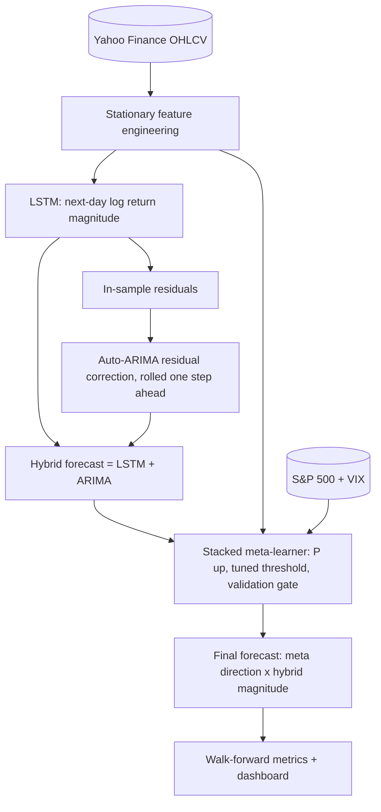

# ARIMA-LSTM Hybrid Stock Prediction Model

A hybrid forecasting pipeline for Apple Inc. (AAPL) daily returns. It combines a **PyTorch LSTM** (non-linear magnitude forecast), **Auto-ARIMA** residual correction (linear error structure) and a **stacked meta-learner** with a validation gate (final direction). It is evaluated with leak-free **walk-forward validation**.

> **Correction (v2).** An earlier version reported 86.67% directional accuracy and 1.53% maximum drawdown on a 30-day window. Those numbers were invalid: the final "meta-learner" step read the actual test-day price direction. v2 removes that step, rebuilds the meta-learner so it is trained only on out-of-sample data, fixes a target-alignment bug, switches the target to log returns, and evaluates on 12 walk-forward windows, with design choices made on a separate development period. The honest results are below.

---

## Architecture



**Per walk-forward fold** (each test window = 30 trading days):

| Rows | Used for |
|---|---|
| `[0, meta_start)` | Train the LSTM (early stopping on its last 15%); fit Auto-ARIMA on its residuals |
| `[meta_start, t0)` (250 days) | Out-of-sample LSTM + ARIMA outputs train the meta-learner; its first 70% / last 30% choose the threshold and the gate |
| `[t0, t0 + 30)` | Final predictions, never seen by any component |

### Features (all stationary, built from OHLCV)
`ret_1`, `ret_5` (log returns), `oc` (ln Close/Open), `hl` (ln High/Low), `vol_z` (volume z-score), `sma10_gap`, `sma50_gap` (Close/SMA − 1), `rsi` (Wilder RSI-14), `macd_norm` (MACD/Close), `vol_20` (20-day realised volatility).
**Target:** next-day log return, ln(C[t+1] / C[t]).
**Meta-learner context:** the base-model outputs, technical features, and S&P 500 / VIX features (`sp_ret_1`, `sp_ret_5`, `vix_log`, `vix_chg`, `rel_1`).

### Meta-learner
Regularised logistic regression (selected on the development period from 8 candidates, including random forests). Its "up" threshold is tuned on an inner chronological split of the meta window. **Gate:** if it does not beat the majority-class rule on that inner split, it falls back to the majority direction for the fold: no validated edge, so follow the base rate.

### Leakage controls
- Every feature at row t uses only data up to the close of day t (tested in `tests/test_no_leakage.py`).
- Scaler fitted on each fold's training rows only.
- The meta-learner is trained on predictions the base models made out-of-sample.
- ARIMA is updated with each residual only after that day's return is known.

---

## Results (walk-forward, 12 × 30-day windows, 360 out-of-sample days)

| Metric | Model | Baseline |
|---|---|---|
| Directional accuracy, meta-learner | 51.4% (binomial p = 0.32) | Always-up 53.9% |
| Directional accuracy, hybrid sign | 50.6% | Yesterday's direction 51.4% |
| Maximum drawdown | 23.0% | Buy-and-hold 23.0% |
| Total return | +23.8% | Buy-and-hold +46.8% |
| Sharpe ratio (annual) | 0.65 | Buy-and-hold 1.03 |
| RMSE next-day price | $4.66 | Naive (tomorrow = today) $4.62 |

The gate fell back to the majority direction in 9 of 12 folds. **Latest 30-day window (13 Jul – 21 Aug 2026):** 53.3% directional accuracy and 11.05% maximum drawdown, both identical to always-up / buy-and-hold because the gate was active.

**Interpretation.** No component beats simple baselines for next-day direction, and the gate correctly recognises this in most folds. Auto-ARIMA finds little or no structure in the LSTM residuals (order (0,0,0) in the latest folds), and the residual ACF is flat. This is consistent with weak-form market efficiency: daily price history carries almost no exploitable directional signal. The value of the project is a correct, leak-free pipeline that measures this rigorously.

---

## Usage

```bash
pip install -r requirements.txt
python preprocessing.py          # download AAPL + S&P 500 / VIX data
python final_hybrid_model.py     # ~10 min on CPU; writes output.txt, results/ and Final_Results_Dashboard.jpg
python -m pytest tests           # leakage tests
```

Settings live in `.env` (window length, hidden size, epochs, walk-forward folds, meta window, seed, transaction cost).

## Files

| File | Purpose |
|---|---|
| `features.py` | Data loading and stationary feature engineering |
| `models.py` | LSTM forecaster, residual Auto-ARIMA, gated stacked meta-learner |
| `market_data.csv` | S&P 500 and VIX closes (meta-learner context) |
| `evaluation.py` | Directional accuracy, drawdown, Sharpe, RMSE, binomial test |
| `final_hybrid_model.py` | Walk-forward pipeline, reports and dashboard |
| `tests/test_no_leakage.py` | Look-ahead-bias tests |
