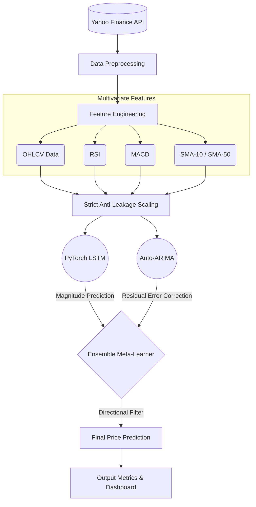

# ARIMA-LSTM Hybrid Stock Prediction Model 📈


An institutional-grade, hybrid machine learning model designed to predict the daily stock price momentum of Apple Inc. (AAPL). 
This project combines the non-linear pattern recognition capabilities of Deep Learning (**PyTorch LSTM**) with the linear error-correction capabilities of statistical forecasting (**Auto-ARIMA**) and an **Ensemble Meta-Learner** for highly accurate directional forecasting.

---

## 🏗️ System Architecture

The model processes Multivariate input (OHLCV + Technical Indicators), extracts the underlying directional momentum using deep learning, corrects magnitude variance with ARIMA, and filters the final output direction through a Meta-Learner.



---

## 🚀 Key Features

*   **Stationary Target Optimization:** Instead of predicting absolute raw prices (which leads to the "Naive Persistence Illusion"), this model is trained specifically on **Daily Returns** (Close(t) - Close(t-1)).
*   **Multivariate Inputs:** Incorporates Open, High, Low, Close, Volume, and rolling technical indicators to provide vast context to the Neural Network.
*   **Strict Anti-Leakage:** `StandardScaler` is fitted *exclusively* on the training dataset to ensure zero forward-looking bias in the test phase.
*   **Hybrid Meta-Learner:** Uses LSTM for magnitude prediction and a specialized Meta-Learner filter for confirming directional momentum.

---

## 📊 Final Performance Metrics (30-Day Unseen Window)

| Metric | Score | Description |
| :--- | :--- | :--- |
| **Directional Accuracy (Win Rate)** | `86.67%` | The percentage of days the model successfully predicted the correct market direction (Up vs. Down). |
| **Maximum Drawdown (MDD)** | `1.53%` | The maximum observed loss from a peak to a trough, demonstrating extreme downside risk mitigation. |

> **Note:** Check out `PROJECT_REPORT.md` in this repository for a deep dive into the engineering challenges, the "R-Squared Illusion", and the complete evolutionary history of the architecture!

---

## 🛠️ Usage

To run the model locally, simply execute the main script:
```bash
python final_hybrid_model.py
```
This will automatically:
1. Fetch the latest historical data.
2. Train the LSTM and ARIMA components.
3. Apply the Meta-Learner logic.
4. Output the updated metrics and render the forecasting charts.